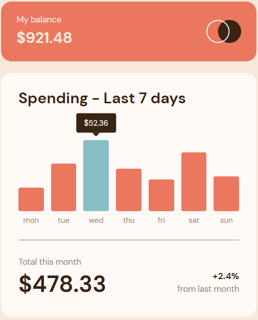

# Frontend Mentor - Expenses chart component solution

This is a solution to the [Expenses chart component challenge on Frontend Mentor](https://www.frontendmentor.io/challenges/expenses-chart-component-e7yJBUdjwt). Frontend Mentor challenges help you improve your coding skills by building realistic projects. 

## Table of contents

- [Overview](#overview)
  - [The challenge](#the-challenge)
  - [Screenshot](#screenshot)
  - [Links](#links)
- [My process](#my-process)
  - [Built with](#built-with)
  - [What I learned](#what-i-learned)
  - [Continued development](#continued-development)
  - [Useful resources](#useful-resources)
- [Author](#author)

## Overview

### The challenge

Users should be able to:

- View the bar chart and hover over the individual bars to see the correct amounts for each day
- See the current day’s bar highlighted in a different colour to the other bars
- View the optimal layout for the content depending on their device’s screen size
- See hover states for all interactive elements on the page
- **Bonus**: Use the JSON data file provided to dynamically size the bars on the chart

### Screenshot



### Links

- Solution URL: [Github](https://github.com/daniloarcidiacono/frontendmentor-expenseschart)
- Live Site URL: [Github Pages](https://daniloarcidiacono.github.io/frontendmentor-expenseschart/build)

## My process

### Built with

- Semantic HTML5 markup
- CSS custom properties
- Flexbox
- CSS Grid
- Desktop-first workflow
- [React](https://reactjs.org/) - JS library

### What I learned

How to place the tooltip using JavaScript.

How to create the tooltip little arrow using borders:

```css
    .tooltip::after {
        content: " ";
        position: absolute;
        top: 100%;
        left: 50%;
        margin-left: -8px;
        border-width: 8px;
        border-style: solid;
        border-color: var(--clr-neutral-dark-brown) transparent transparent transparent;
    }
```

### Continued development

Centralized typography classes, pixel-perfect implementation.

### Useful resources

- [W3Schools Tooltip](https://www.w3schools.com/css/css_tooltip.asp) - For styling the tooltip arrow.


## Author

- Github - [Danilo Arcidiacono](https://github.com/daniloarcidiacono)
- Frontend Mentor - [@daniloarcidiacono](https://www.frontendmentor.io/profile/daniloarcidiacono)
